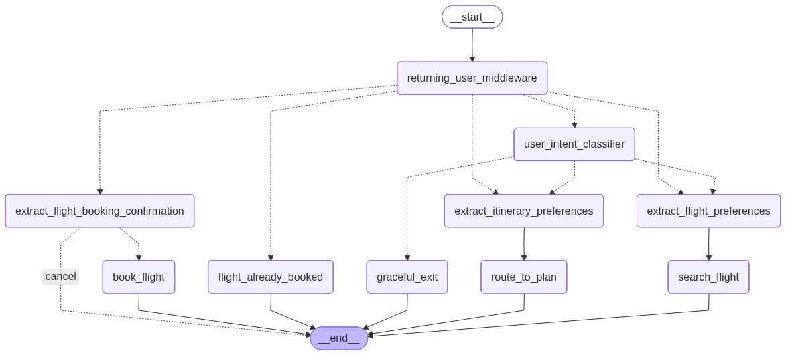

# Open Agent Evaluation Playground

Minimal agentic system (LangChain, LangGraph) with flight booking and routing.

## Workflow



## Run with Docker

1. Copy env and set your API keys:
   ```bash
   cp .env.sample .env
   # Edit .env: OPENAI_API_KEY, LANGFUSE_* (see .env.sample)
   ```

2. Start backend, frontend, and DB:
   ```bash
   docker compose up --build
   ```

3. Open **http://localhost:3000** (frontend) and **http://localhost:8080** (API).

*Generate the workflow diagram:* from repo root run `python -m backend.app_workflow` (writes `workflow_graph.png`).
